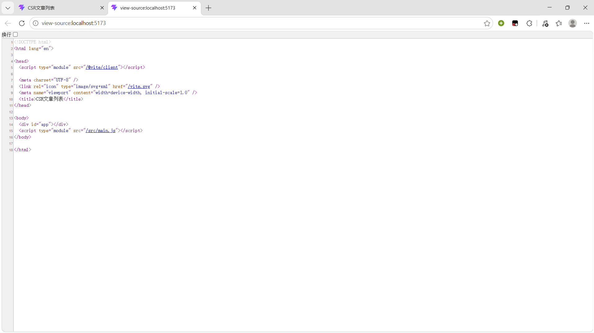
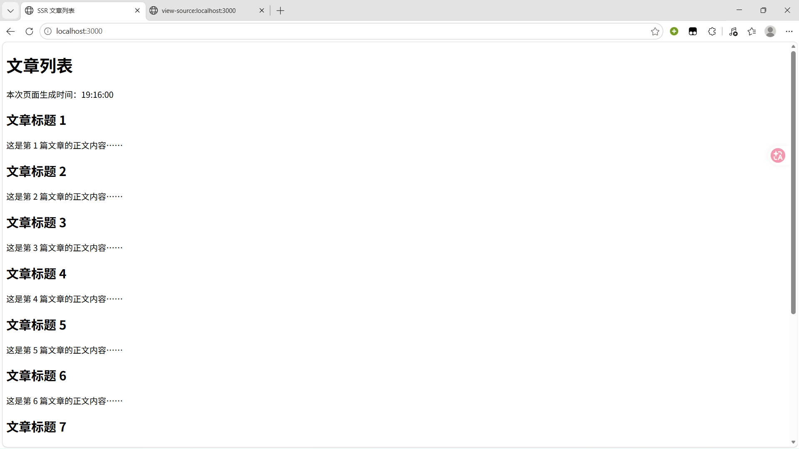
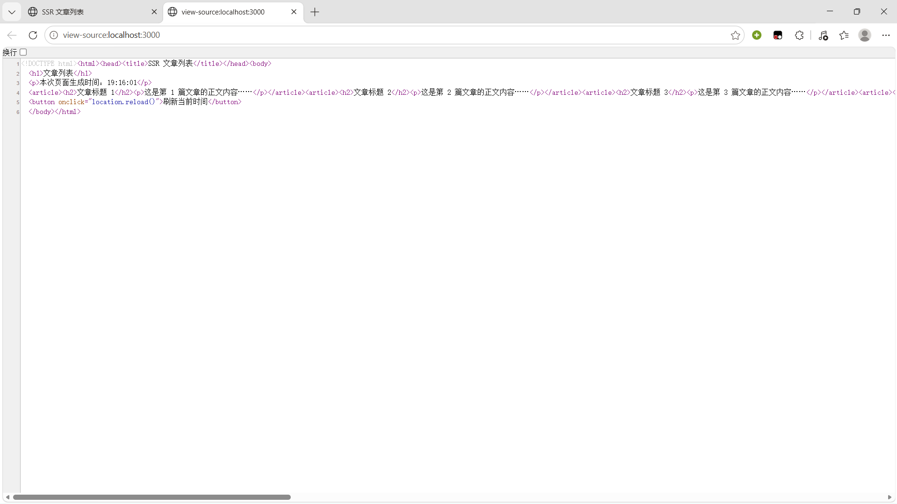
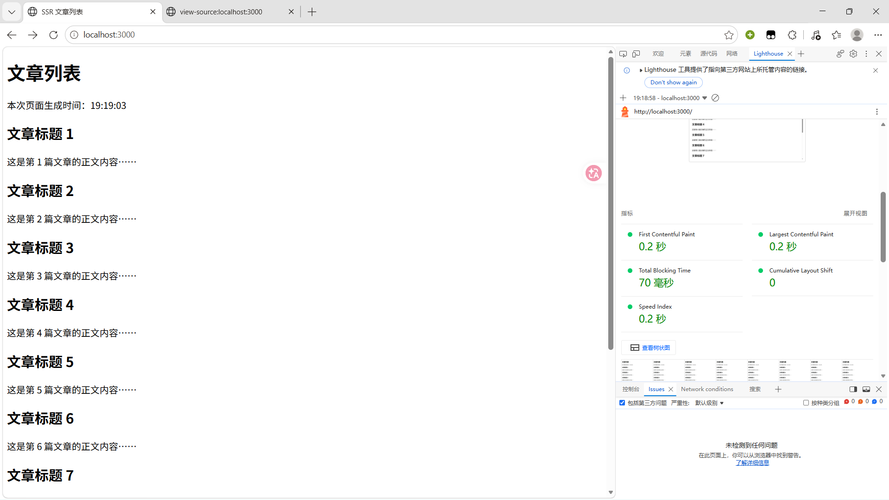
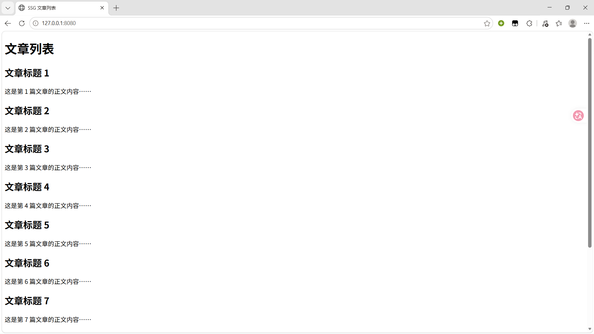
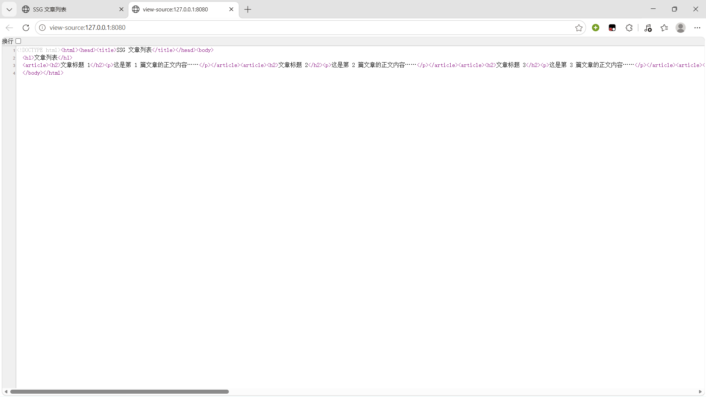
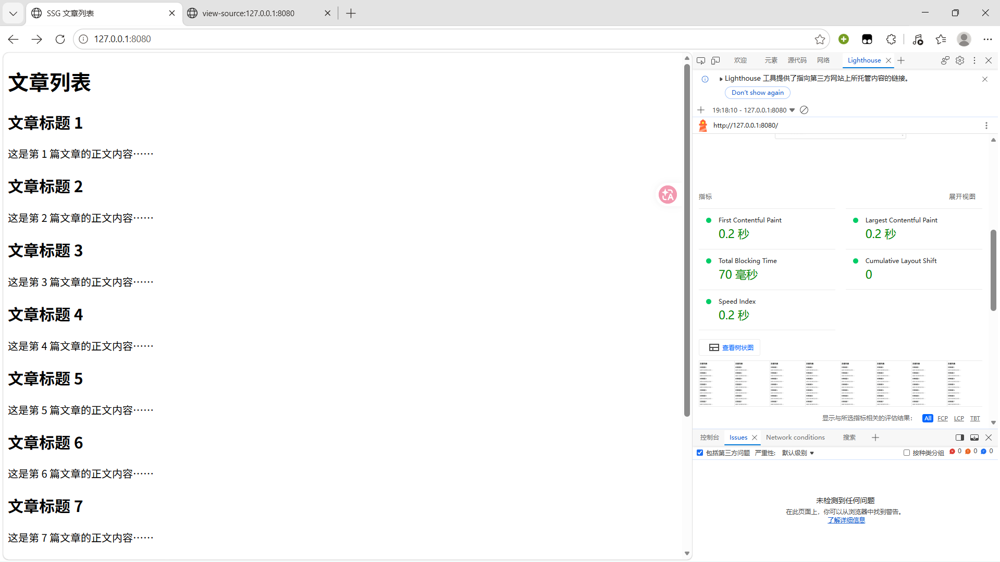

# 实验一 CSR‑SSR‑SSG渲染对比
## 一、实验目的
1. 直观理解CSR、SSR、SSG三种渲染模式执行流程与本质差异，了解ISR混合渲染。
2. 通过FCP、LCP、HTML源码等指标量化不同渲染模式的性能、SEO表现。
3. 掌握渲染模式选型思路：内容是否变化、是否需要个性化、对首屏速度敏感度。
4. 理解前端渲染模式的演进历史，理解SPA兴起之后SSR、SSG重新流行的原因。

## 二、实验环境
硬件：个人PC；
软件：Node.js v24.21.0，pnpm 12.5.1，Microsoft Edge，VS Code；
技术栈：Vite6（CSR），Express4（SSR），Node fs模块实现SSG。

## 三、实验原理
1. **CSR客户端渲染**：服务器返回空HTML骨架，JS全部下发到浏览器，浏览器执行JS生成页面。首屏慢，SEO差，页面交互体验好。
2. **SSR服务端渲染**：每收到一次浏览器请求，服务端现场拼接完整HTML返回浏览器，首屏快，SEO友好；页面需要水合Hydration才可以拥有交互能力。
3. **SSG静态站点生成**：构建阶段一次性生成完整静态HTML文件，部署到CDN，访问直接返回静态文件，速度最快最稳定；缺点内容更新需要重新构建。
4. **ISR增量静态再生成**：SSG的补充，设置重校验时间，访问后后台重新生成页面，兼顾静态速度和内容更新。
5. Web Vitals指标：FCP首次内容绘制，LCP最大内容绘制，衡量用户真实加载体验。

## 四、实验步骤与结果截图
### 任务一 CSR Vite客户端渲染

自检结论：
1. 开发服务器5173可以正常渲染10篇文章。
2. 网页源代码中app容器为空，文章全部由浏览器JS动态渲染，源码看不到正文。
3. Network面板加载main.js脚本，页面内容完全由前端JS完成渲染。

### 任务二 SSR Express服务端渲染

自检结论：
1. 页面正常显示10篇文章，附带页面生成时间。
2. 网页源代码直接包含全部文章内容，对搜索引擎SEO友好。
3. 页面刷新，生成时间发生变化，证明**每一次HTTP请求，服务器都会现场拼接HTML返回浏览器**。

### 任务三 SSG静态站点生成

自检结论：
1. 执行`node build-ssg.js`成功生成dist/index.html静态文件。
2. HTML在构建阶段就写入全部文章正文与完整DOM结构。
3. 多次刷新页面，内容完全不变，访问时服务器只返回现成静态文件，运行期没有计算。

### 任务四 性能测量结果
|模式|首屏HTML大小|白屏时间(FCP)|LCP|SEO(源码含正文?)|适用场景|
|---|---|---|---|---|---|
|CSR| | | |否|后台管理系统、强交互页面、SEO要求低|
|SSR| | | |是|内容动态更新、需要SEO、需要个性化页面|
|SSG| | | |是|博客、文档、静态活动页、内容不常更新|

## 五、部署地址
- CSR静态部署地址：【粘贴你的EdgeOne Pages/帽子云HTTPS链接】
- SSG静态部署地址：【粘贴你的EdgeOne Pages/帽子云HTTPS链接】
- SSR云托管部署地址：【粘贴腾讯云CloudBase云托管域名链接】
Gitee仓库地址：【粘贴你的gitee公开仓库地址】

## 六、思考题（必答题）
### （1）为什么SPA时代SEO差？
SPA大多使用CSR客户端渲染。服务器返回的HTML是空骨架，文章内容需要浏览器下载、执行JS之后才渲染出来。搜索引擎爬虫不会执行前端JS，读取HTML源码看不到页面真实内容，因此SPA项目SEO效果较差。

### （2）SSG与SSR的本质区别是什么？
- SSG：**构建阶段一次性生成完整HTML**，用户访问直接返回预生成静态文件，运行时服务器不做计算，内容更新必须重新构建。
- SSR：**用户请求时实时渲染HTML**，每次请求服务端动态生成页面，数据实时更新，无需重新打包构建。

### （3）结合渲染模式演进写200字左右总结
前端渲染模式经历了多次迭代。早期为服务端整页渲染，但是每次跳转都需要刷新页面，体验较差。随后SPA客户端渲染兴起，将渲染逻辑迁移至浏览器，实现了页面无刷新跳转，交互体验大幅提升，但存在首屏加载慢、SEO不友好等问题。为解决这些缺陷，SSR服务端渲染回归，通过服务端输出完整HTML优化首屏与SEO。SSG在构建阶段预生成页面，进一步提升访问性能。ISR则弥补了SSG无法动态更新的短板。不同渲染模式各有优劣，项目需要根据业务场景、更新频率、SEO需求灵活选型。

### （4）前三个实验任务分别使用什么服务器？运行机制？
1. CSR：Vite开发服务器。服务器返回空HTML和JS资源，由浏览器执行JS动态生成页面DOM，完成渲染。
2. SSR：Express Node服务器。接收客户端请求后，服务端动态拼接完整HTML页面并返回给浏览器。
3. SSG：Node脚本构建静态资源，通过静态HTTP服务器直接返回已生成的HTML文件，运行时不做渲染计算。

### （5）实时更新的股票行情页，CSR/SSR/SSG/ISR哪个最合适？为什么？
**CSR最合适**。股票行情属于高频实时数据，秒级不断变化。SSG页面构建后固定无法更新，ISR更新存在时间间隔，SSR每次请求渲染开销大、无法高频刷新。而CSR可以在前端通过轮询实时更新数据，无需刷新页面，交互流畅、适配高频数据场景。

### （6）为什么SSR需要水合Hydration？没有水合会怎样？
SSR返回的仅是静态HTML结构，页面仅能展示内容，无法响应点击、输入等交互事件。水合是浏览器加载JS后，为已有DOM绑定事件、恢复页面交互能力的过程。**如果没有水合，SSR页面只是一张静态页面，所有交互全部失效。**

## 七、实验体会
本次实验完整实现了CSR、SSR、SSG三种前端渲染模式，直观对比了三种模式的渲染机制、页面表现与性能差异。通过查看网页源码、刷新页面对比变化、Lighthouse性能测试，深刻理解了三种渲染模式的优缺点与适用场景。实验过程中解决了编码格式报错、服务启动失败、中文乱码、模块语法冲突等问题，加深了对前端渲染底层原理的理解，提升了前端工程实践能力。
